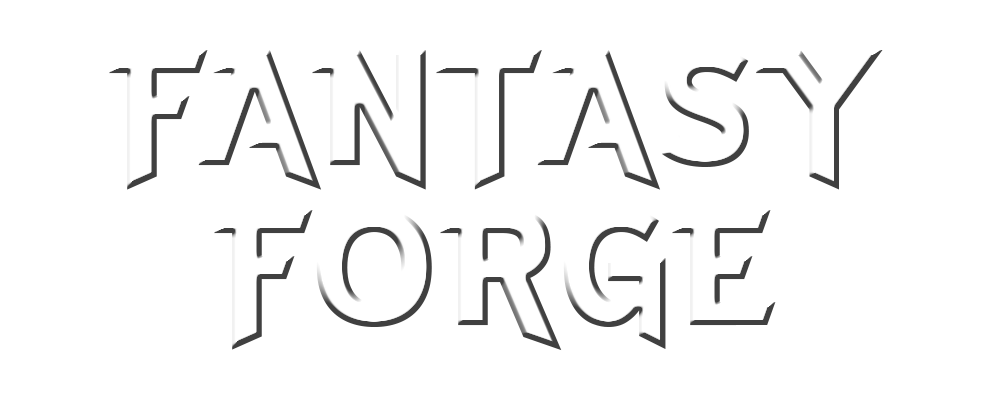

<p align="center">
  <picture>
    <source media="(prefers-color-scheme: light)" srcset="icon.png">
    
  </picture>
</p>
<h1 align="center">Create your own story</h1>


Fantasy Forge is a text-based story game where you create a character and play as it, navigating through a fantastical world, and having control of your character's actions in the game. It uses gpt-3.5 turbo, and was coded with python. 

This project was created for Leland CS club hackathon.

Download the .exe if you are on windows. If you are on mac, you will have to download the source code and install the dependencies.

# Install instructions
If you download the source code, you need your own API key, as well as importing the following (in command prompt):

**For windows:** (Make sure you have python to install)
```
pip install pillow
pip install openai
pip install tkinter
```

**For mac:** (Make sure you have python to install)
```
pip3 install pillow
pip3 install openai
pip3 install tkinter
```

After that, run `main.py`

You get a free OpenAI key when you create an account, to access it, go to https://platform.openai.com/account/api-keys

